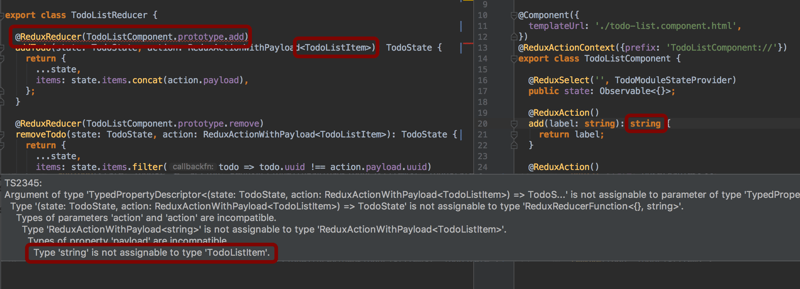

# @harmowatch/ngx-redux-core

[](https://badge.fury.io/js/%40harmowatch%2Fngx-redux-core)
[](https://renovateapp.com/)
[](https://travis-ci.org/HarmoWatch/ngx-redux-core)
[](http://hits.dwyl.com/harmowatch/ngx-redux-core)
[](https://codeclimate.com/github/HarmoWatch/ngx-redux-core/maintainability)
[](https://codeclimate.com/github/HarmoWatch/ngx-redux-core/test_coverage)

## The modern redux integration for Angular 2+

This package contains a number of features that makes working with Redux easy. For example, 
you can decorate a method with [@ReduxAction](./docs/decorators/redux-action.md). This method then 
sends a redux action every time it's been called. In addition to [@ReduxAction](./docs/decorators/redux-action.md) 
there are some more decorators available like [@ReduxActionContext](docs/decorators/redux-action-context.md), 
[@ReduxReducer](./docs/decorators/redux-reducer.md), [@ReduxSelect](./docs/decorators/redux-select.md) and
[@ReduxState](./docs/decorators/redux-state.md). But that's not all! By using this package, you can also access 
your redux state directly from your view.

```angular2html
<pre>{{ 'some/state/path' | reduxSelect | async | json }}</pre>
```
Another big advantage of this package is the TypeScript support. You'll get a compiler error if  the payload 
of the redux action is not compatible with the reducer function.



Of course, this package works with [RxJS](https://github.com/ReactiveX/rxjs) and the AOT compiler.

### What is Redux?

[Redux](http://redux.js.org/) is a popular and common approach to manage an application state. The three principles of redux are:

- [Single source of truth](http://redux.js.org/docs/introduction/ThreePrinciples.html#single-source-of-truth)
- [State is read-only](http://redux.js.org/docs/introduction/ThreePrinciples.html#state-is-read-only)
- [Changes are made with pure functions](http://redux.js.org/docs/introduction/ThreePrinciples.html#changes-are-made-with-pure-functions)

### Why @harmowatch/ngx-redux-core?

- [x] Better TypeScript support for [redux reducers](./docs/decorators/redux-reducer.md)
- [x] All your [redux actions](./docs/decorators/redux-action.md) are strongly typed by default
- [x] You don't need to define constants and switch statements for your action names
- [x] Easy refactoring of [redux actions](./docs/decorators/redux-action.md)
- [x] Reduced boilerplate when using redux patterns trough [decorators](./docs/decorators/index.md)
- [x] Support for [lazy loaded modules](./docs/how-to/use-lazy-loading.md)
- [x] A [Angular Pipe](https://angular.io/guide/pipes) to select state values
- [x] Easy to test - *docs are work in progress*
- [x] Easy to learn
- [x] [Redux DevTools Extension](https://github.com/zalmoxisus/redux-devtools-extension) is enabled automatically [in dev mode](https://angular.io/api/core/isDevMode)

### Installation

The redux package is not shipped with @harmowatch/ngx-redux-core. 
Therefore you also have to install the redux package:

```sh
$ npm install redux @harmowatch/ngx-redux-core --save
```

### Quickstart

#### 1. Import the root `ReduxModule`:

As the first step, you need to add `ReduxModule.forRoot()` to the root NgModule of your application.

The static [`forRoot`](https://angular.io/docs/ts/latest/guide/ngmodule.html#!#core-for-root) method is a convention
that provides and configures services at the same time. Make sure you call this method only in your root NgModule!

[Lazy loading is also supported](./docs/how-to/use-lazy-loading.md)

```ts
import { NgModule } from '@angular/core';
import { BrowserModule } from '@angular/platform-browser';
import { ReduxModule } from '@harmowatch/ngx-redux-core';

import {YourModuleStateProvider} from '...';
import {TodoListReducer} from '...';

@NgModule({
  imports: [
    BrowserModule,
    ReduxModule.forRoot({
      state: {
        provider: YourModuleStateProvider, // You'll create it in step 2
        reducers: [ TodoListReducer ], // You'll create it in step 4
      }
    }),
  ],
  providers: [
    YourModuleStateProvider // You'll create it in step 2
  ],
})
export class AppModule {
}
```

#### 2. Create a state provider

Now you have to create a provider for your module in order to describe your state.

```ts
import { Injectable } from '@angular/core';
import { ReduxState, ReduxStateProvider } from '@harmowatch/ngx-redux-core';

export interface YourModuleState {
  todoListItems: string[];
}

@Injectable()
@ReduxState({name: 'your-module'}) // Make sure you choose a application-wide unique name
export class YourModuleStateProvider extends ReduxStateProvider<YourModuleState> {

  getInitialState(): Promise<YourModuleState> { // You can return Observable<YourModuleState> or YourModuleState as well
    return Promise.resolve({
      items: []
    });
  }}

}
```

> Don't forget to add the state as described in step 1

#### 3. Create an action dispatcher

To initiate a state change, a redux action must be dispatched. Let's assume that there is a component called 
`TodoListComponent` that displays a button. Each time the button is clicked, the view calls the function 
`addTodo` and passes the todo, which shall be added to the list. 

All you have to do is decorate the function with `@ReduxAction` and return the todo as a return value.

```ts
import { Component } from '@angular/core';
import { ReduxAction } from '@harmowatch/ngx-redux-core';

@Component({templateUrl: './todo-list.component.html'})
export class TodoListComponent {

  @ReduxAction()
  addTodo(label: string): string {
    return label; // your return value is the payload
  }

}
```

Now `@harmowatch/ngx-redux-core` will dispatch the following action, every time the `addTodo` method was called:

```json
{
  "type": "addTodo",
  "payload": "SampleTodo"
}
```

[You can also create a provider to fire the actions.](./docs/how-to/create-a-actions-provider.md)

#### 4. Create the reducer

There's one more thing you need to do. You're firing an action, but at the moment no reducer is listening to it.
In order to change this, we need to create a reducer function that can make the state change as soon as the action 
is fired:

```ts
import { ReduxReducer, ReduxActionWithPayload } from '@harmowatch/ngx-redux-core';

import {TodoListComponent} from '...';

export class TodoListReducer {

  @ReduxReducer(TodoListComponent.prototype.add)
  addTodo(state: TodoState, action: ReduxActionWithPayload<string>): TodoState {
    return {
      ...state,
      items: state.items.concat(action.payload),
    };
  }

}
```  

> Don't forget to add the state as described in step 1

### 5. Display the todo items in the view

To display the todo items you just can use the [reduxSelect](./docs/pipes/redux-select.md) pipe.
Alternatively, you can also use the [@ReduxSelect](./docs/decorators/redux-select.md) decorator.

```angular2html
<ul>
  <li *ngFor="let todo of ('items' | reduxSelect | async)">{{todo}}</li>
</ul>
```

### Documentation

I am still working on the [documentation](./docs/index.md), but I wanted to release the new 0.2.x version of the package 
as soon as possible. Therefore, the latest version of the [documentation](./docs/index.md) will only be available on Github 
for the time being, in order to avoid an unnecessary version patch for each update. 
