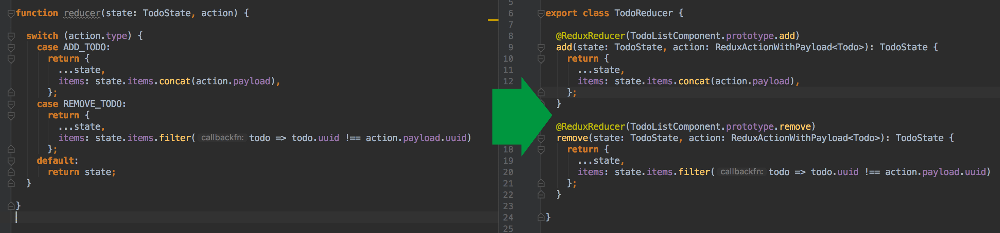

# @harmowatch/ngx-redux-core

[](https://gitter.im/harmowatch/ngx-redux-core?utm_source=badge&utm_medium=badge&utm_campaign=pr-badge&utm_content=badge)

[](https://badge.fury.io/js/%40harmowatch%2Fngx-redux-core)
[](https://renovateapp.com/)
[](https://travis-ci.org/HarmoWatch/ngx-redux-core)
[](http://hits.dwyl.com/harmowatch/ngx-redux-core)
[](https://codeclimate.com/github/HarmoWatch/ngx-redux-core/maintainability)
[](https://codeclimate.com/github/HarmoWatch/ngx-redux-core/test_coverage)

## The modern [Redux](http://redux.js.org/) integration for [Angular](https://angular.io/) 2+

This package contains a number of features that makes working with [Angular](https://angular.io/) and [Redux](http://redux.js.org/) 
very easy and comfortable. This is achieved using [decorators](./docs/decorators/index.md). For example, you can decorate any class 
method with [@ReduxAction](./docs/decorators/redux-action.md). Every time the method is called it will dispatch a redux action.

- [Main Features](#main-features)
  - [TypeScript support](#typescript-support)
  - [Reduced boilerplate](#reduced-boilerplate)
  - [Refactoring support](#refactoring-support)
  - [Easy to test](#easy-to-test)
    - [Matchers](#matchers)
      - [toDispatchAction](#todispatchaction)
      - [toReduceOn](#toreduceon)
      - [notToMutateTheGivenState](#nottomutatethegivenstate)
  - [The Select Pattern](#the-select-pattern)
  - [Lazy Loaded Modules](#lazy-loaded-modules)
  - [Redux DevTools Extension support](#redux-devtools-extension-support)
- [What is Redux?](#what-is-redux)
- [Installation](#installation)
- [Quickstart](#quickstart)
- [Documentation](./docs/index.md)

## Main Features

### TypeScript support

One big advantage of this package is the [TypeScript](https://www.typescriptlang.org/) support for reducer functions. 
By using this package, you'll get a compiler error, if the payload of the redux action is not compatible with the reducer.


----

### Reduced boilerplate 

The decorators will save you a lot of boilerplate code, so for example you don't have to call an extra
service to dispatch the redux action anymore. Also the annoying switch-cases on the action-types are replaced by the 
[@ReduxReducer](./docs/decorators/redux-reducer.md) decorator:



----

### Refactoring support

Refactoring is improved as well, since you refer directly to the action method and not to a string.
Therefore, your IDE can also modify your reducer, when the action method was renamed.

----

### Easy to test

#### Matchers

There are some jasmine matchers provided by this package. This makes it easy to test whether a method triggers a redux action and 
if the reducer really listens to it. There is also a matcher available which will ensure that the reducer does not work on the state reference.
For more information about testing and matcher installation, please see the [Testing Guide](./docs/articles/testing-guide.md).

##### toDispatchAction

```ts
it('will dispatch a redux action', () => {
  expect(TodoListComponent.prototype.toggleListMode).toDispatchAction();
  // or test for a specific action name
  expect(TodoListComponent.prototype.toggleListMode).toDispatchAction('toggleListMode');
});
```

##### toReduceOn

```ts
it('listens to the correct actions', () => {
  expect(TodoReducer.prototype.add).toReduceOn(TodoListComponent.prototype.add);
});
```

##### notToMutateTheGivenState

```ts
it('does not mutate the given state', () => {
  expect(TodoReducer.prototype.add).notToMutateTheGivenState(state);
});
```

----

### The Select Pattern

The [Select Pattern](./docs/articles/select-pattern.md) gives you a powerful tool-set at your hand, to select slices of your state.
The easiest way to access a state value is the [reduxSelect pipe](./docs/articles/select-pattern.md#the-reduxselect-decorator):

```angular2html
<pre>{{ 'some/state/path' | reduxSelect | async | json }}</pre>
```

----

### Lazy Loaded Modules

[Lazy Loaded Modules](./docs/how-to/use-lazy-loading.md) are also supported.
So you can only initialize the reducer and the state when the respective NgModule is loaded.

----

### Redux DevTools Extension support

The [Redux DevTools Extension](https://github.com/zalmoxisus/redux-devtools-extension) is fully supported and automatically
enabled if your Angular app is running [in dev mode](https://angular.io/api/core/isDevMode).

----

### What is Redux?

[Redux](http://redux.js.org/) is a popular and common approach to manage an application state. 
The three principles of redux are:

- [Single source of truth](http://redux.js.org/docs/introduction/ThreePrinciples.html#single-source-of-truth)
- [State is read-only](http://redux.js.org/docs/introduction/ThreePrinciples.html#state-is-read-only)
- [Changes are made with pure functions](http://redux.js.org/docs/introduction/ThreePrinciples.html#changes-are-made-with-pure-functions)

----

## Installation

The [redux](https://github.com/reactjs/redux) package itself is not shipped with @harmowatch/ngx-redux-core.
Therefore you also have to install the redux package:

```sh
$ npm install redux @harmowatch/ngx-redux-core --save
```

----

## Quickstart

### 1. Import the root `ReduxModule`:

As the first step, you need to add `ReduxModule.forRoot()` to the root NgModule of your application.

The static [`forRoot`](https://angular.io/docs/ts/latest/guide/ngmodule.html#!#core-for-root) method is a convention
that provides and configures services at the same time. Make sure you call this method only in your root NgModule!

Please note that [Lazy loading](./docs/how-to/use-lazy-loading.md) is also supported.

```ts
import { NgModule } from '@angular/core';
import { BrowserModule } from '@angular/platform-browser';
import { ReduxModule } from '@harmowatch/ngx-redux-core';

import {YourModuleStateProvider} from '...';
import {TodoListReducer} from '...';

@NgModule({
  imports: [
    BrowserModule,
    ReduxModule.forRoot({
      state: {
        provider: YourModuleStateProvider, // You'll create it in step 2
        reducers: [ TodoListReducer ], // You'll create it in step 4
      }
    }),
  ],
  providers: [
    YourModuleStateProvider // You'll create it in step 2
  ],
})
export class AppModule {}
```

### 2. Create a state provider

Now you have to create a provider for your module in order to describe and initialize the state.

```ts
import { Injectable } from '@angular/core';
import { ReduxState, ReduxStateProvider } from '@harmowatch/ngx-redux-core';

export interface YourModuleState {
  items: string[];
}

@Injectable()
@ReduxState({name: 'your-module'}) // Make sure you choose a application-wide unique name
export class YourModuleStateProvider extends ReduxStateProvider<YourModuleState> {

  getInitialState(): Promise<YourModuleState> { // You can return Observable<YourModuleState> or YourModuleState as well
    return Promise.resolve({
      items: []
    });
  }}

}
```

> Don't forget to add the state as described in step 1

You can have just one `ReduxStateProvider` per NgModule. But it's possible to have a state provider for each 
[lazy loaded](./docs/how-to/use-lazy-loading.md) module.

### 3. Create an action dispatcher

To initiate a state change, a redux action must be dispatched. Let's assume that there is a component called 
`TodoListComponent` that displays a button. Each time the button is clicked, the view calls the function 
`addTodo` and passes the todo, which shall be added to the list. 

All you have to do is decorate the function with `@ReduxAction` and return the todo as a return value.

```ts
import { Component } from '@angular/core';
import { ReduxAction } from '@harmowatch/ngx-redux-core';

@Component({templateUrl: './todo-list.component.html'})
export class TodoListComponent {

  @ReduxAction()
  addTodo(label: string): string {
    return label; // your return value is the payload
  }

}
```

Now the following action is dispatched, every time the `addTodo` method was called:

```json
{
  "type": "addTodo",
  "payload": "SampleTodo"
}
```

[You can also create a provider to dispatch actions.](./docs/how-to/create-an-actions-provider.md)

### 4. Create the reducer

There's one more thing you need to do. You dispatch an action, but at the moment no reducer is listening to it.
In order to change this, we need to create a reducer function that can make the state change as soon as the action 
is fired:

```ts
import { ReduxReducer, ReduxActionWithPayload } from '@harmowatch/ngx-redux-core';

import {TodoListComponent} from '...';

export class TodoListReducer {

  @ReduxReducer(TodoListComponent.prototype.add)
  addTodo(state: TodoState, action: ReduxActionWithPayload<string>): TodoState {
    return {
      ...state,
      items: state.items.concat(action.payload),
    };
  }

}
```  

> Don't forget to add the state as described in step 1

### 5. Select values from the state

To select a state value, you just can use the [reduxSelect](./docs/pipes/redux-select.md) pipe.
But you've several options to select a state value. Please check out the 
[Select Pattern](./docs/articles/select-pattern.md) article for more information.

```angular2html
<ul>
  <li *ngFor="let todo of ('items' | reduxSelect | async)">{{todo}}</li>
</ul>
```

----

## Documentation

You'll find the latest docs [here](./docs/index.md).

----

You like the project? Then please give me a Star and add you to the list of [Stargazers](https://github.com/HarmoWatch/ngx-redux-core/stargazers).
